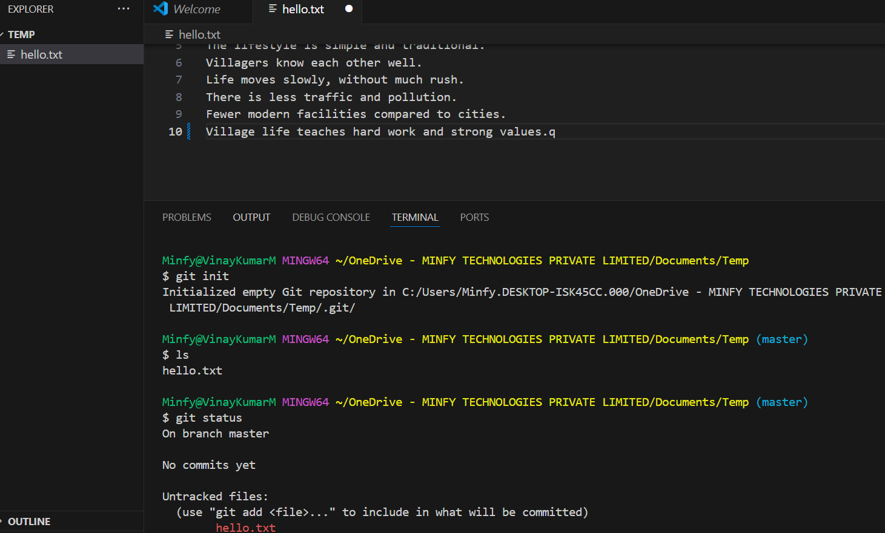

# Git Assignment 1: Basic Git Workflow

## Objective
Learn fundamental Git commands and practice the basic Git workflow.

## Tasks Completed

1. Initialized a local Git repository.
2. Created a simple text file, `hello.txt`, with content related to "College life."
3. Staged and made the initial commit with a meaningful message: `first commit`.
4. Made three meaningful commits using Conventional Commits format:
   - **first**: Added initial content on college life
   - **second**: Updated the content to explain village life
   - **third**: Corrected formatting and rephrased some sentences
5. Used `git log` to view the commit history.
6. Used `git diff` to examine the differences between commits.

### Initialise:
git init

## Commit History

### First Commit:
git commit -m "first commit"

### Second Commit:
git commit -m "second commit"

### Third commit:
git commit -m"third commit"

### Git Log:
git log
commit cd49af1107e1eda38d0b7dbe9cb27db4f18cc333 (HEAD -> master)
Author: VinaykumarMinfy <vinaykumar.mattapally@minfytech.com>
Date:   Mon May 5 14:00:56 2025 +0530

    third commit

commit 1025b725d94fd4a43b4d58c71f6c9913eaedf5db
Author: VinaykumarMinfy <vinaykumar.mattapally@minfytech.com>
Date:   Mon May 5 13:47:10 2025 +0530

    second commit

commit c77b35f1a77527b5fe38a4d1d88be294d8fa9d50
Author: VinaykumarMinfy <vinaykumar.mattapally@minfytech.com>
Date:   Mon May 5 13:39:49 2025 +0530

    first commit

### Git diff 
git diff c77b35f 1025b72
diff --git a/hello.txt b/hello.txt
index 40e3d67..222af3b 100644
--- a/hello.txt
+++ b/hello.txt
@@ -1,7 +1,10 @@

git diff 1025b72 cd49af1
diff --git a/hello.txt b/hello.txt
index 222af3b..5424237 100644
--- a/hello.txt
+++ b/hello.txt
@@ -1,10 +1,10 @@

## Updated By
Vinay Kumar  
Date: 5th May 2025
